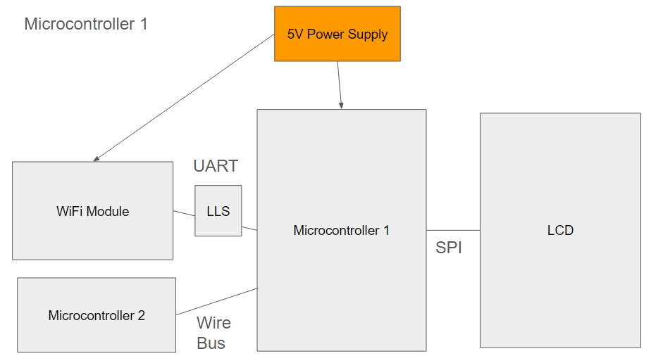
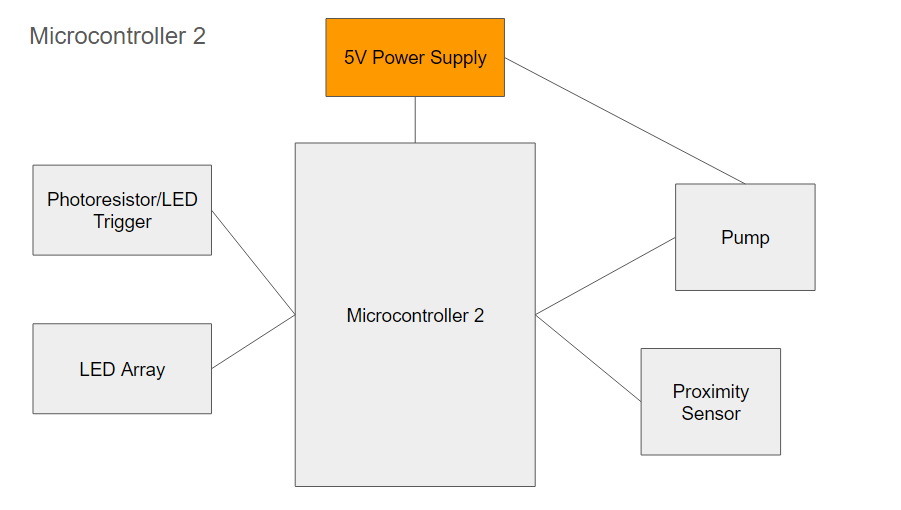

# TimeSink
## ESE 3500 Final Project: Team 14
### Jason Ventura and Eric Zou
  
    * Team Name: TimeSink
    * Team Members: Jason Ventura, Eric Zou
    * Github Repository URL: https://github.com/ese3500/final-project-timesink
    * Github Pages Website URL: https://ese3500.github.io/final-project-timesink/
    * Description of hardware: Laptop, ATmega328PB (2), ESP 32 Feather, LEDs, 5V Peristaltic Pump, 120VAC-5VDC Wall Outlet Converter, PIR Motion Sensor, Joystick, Button, Photoresistors

## Final Project Proposal

### 1. Abstract

Our final project is TimeSink, an all-in-one tool to handle common bathroom needs, reducing clutter on valuable sink counter real estate while offering a variety of useful features in one place.

### 2. Motivation

Bathroom counters can be subject to some of the most pressing space constraints out of any place in the home. It can often be a daunting challenge to iterate on and settle on an arrangement of various home products like toothbrushes, toothpaste, and soap that conserves space while maintaining convenience. Additionally, the sink itself does little in the way of active assistance to the user, with no built-in functionality like lights or clocks. All of these issues combined can often result in the perfect storm, conspiring against users to leave the bathroom sink counter disorganized, unclean, and messy. 

We believe that TimeSink can help people organize their bathroom sink counter like never before. We want to make it easy to store and access the 20% of items and tools that will be used 80% of the time in a bathroom setting, including soap dispensing, nightlight, weather sync and time sync. We want our device to reduce cognitive load in critical times such as the morning rush or before bedtime and and help users establish a rhythm for their routines.

### 3. Goals

1. We want a digital display with current time and weather from WiFi.
2. We want an automatic soap dispenser.
3. We want the device to have user input for WiFi configuration.
4. We want to have a proximity-activated night light
5. We want the device to be wall-chargable.
6. We want to have a toothbrush holder with gravity-based moisture removal.
7. We want the product to fit within 4x4 inch maximum base dimensions.
8. We want the device to be waterproof.

### 4. Software Requirements Specification (SRS)

**SRS 1.** Software shall be written in C for ATmega328PB microcontrollers.

**SRS 2.** Software shall be written in C++ for ESP32 Feather WiFi module.

**SRS 3.** ATmega328PB shall encode communication with Feather in accordance with the SPI protocol.

**SRS 4.** ATmega328PB shall encode communication with LCD screen in accordance with the SPI protocol.

**SRS 5.** Software shall process ultrasonic sensor values to detect proximity.

**SRS 6.** Software shall evaluate ultrasonic sensor readings to trigger peripheral motor when hand is within 4 cm.

**SRS 7.** Software shall correctly evaluate ultrasonic sensor and photoresistor readings to trigger peripheral LED in darkness when motion is detected.

**SRS 8.** ATmega328PB controlling peripherals will set pins to signal actions to ATmega328PB controlling LCD.

**SRS 9.** Software shall maintain weather data via API calls over WiFi, accurate to within 1 hour.

**SRS 10.** Software shall maintain time data via API calls over WiFi to within 10s of real time.

**SRS 11.** Software shall use PWM to control motor to dispense soap.

**SRS 12.** Software shall set LED light pin for 2 minutes when nearby object detected.

**SRS 13.** Software shall handle user setting customization of location.

### 5. Hardware Requirements Specification (HRS)

**HRS 1.** Project shall contain a wall-based power supply that converts AC to 5V DC.

**HRS 2.** Project shall be contained within a 3D printed shell waterproofed by sealant.

**HRS 3.** Project shall use servo motor as trapdoor to dispense soap.

**HRS 4.** Project shall have ultrasonic sensor for hand detection.

**HRS 5.** Project shall contain ultrasonic sensor for motion detection.

**HRS 6.** Project shall contain photoresistor that detects ambient brightness.

**HRS 7.** Project shall contain bright LED light that can light up room in the dark.

**HRS 8.** Project shall contain LCD that is wired to an ATmega328PB microcontroller via an SPI interface.

**HRS 9.** User interface shall be button-based.

**HRS 10.** ATmega328PB will be attached to ESP32 Feather Module using 3.3V-5V Logic Level Shifter.

**HRS 11.** Device shall use gravity to drain toothbrush storage container.

**HRS 12.** Device shall fit within a 4x4 inch space.

### Block Diagram

### 6. MVP Demo

1. Dispenser firmware and hardware model (servo and photoresistor)
2. API calls with ESP32 Feather
3. UART between Feather and ATMega328PB
4. Weather info on ATmega328PB
5. Proximity light firmware and hardware model (ultrasonic sensor and LED)

### 7. Final Demo

1. GUI for WiFi connection and location selection, controlled with buttons
2. Photoresistor for external light detection to deactivate night light
3. Time information displayed on LCD
4. 3D printed Housing with toothbrush/toothpaste holder
5. Waterproofing with sealant
6. 1 hr updates/resync of data
7. LCD displays triggered actions (night light, soap)
8. Organized wiring and power delivery in one box

### 8. Methodology

We would like to 3D print a frame and housing for each of the components. Ideally, each would have their own compartments/sections in the superstructure for easy assembly. However, each component would essentially be independent, consisting of its own sensor/actuator pair. For example, a dispenser is composed of an ultrasonic sensor to detect proximity of hand or toothbrush, and a motor-based actuator to dispense the required substance.

### 9. Components

- ATmega328PB
- Bright LEDs
- LCD Screen
- ESP32 Feather WiFi Board
- 3.3V-5V Bidirectional Logic Level Shifter
- 5V wall power supply
- Peristaltic Pump
- Photoresistors
- PIR Motion Sensor
- ~~Ultrasonic Sensors~~
- ~~3D Printed Shell~~
- ~~Servo Motor~~
- ~~Sealant~~

### 10. Evaluation

#### Dispenser
- Dispenser detects hand positions correctly (within activation range or not) at least 9 times in 10 trials (stimulus)
- 0.5 g soap is dispensed

#### Display
- Display maintains a real-time synced with external clock or user-set (within 10s of set/real time)
- Display gathers current weather information from 3rd party IOT device and displays it (within 1 hr)

#### Lights
- UV light activates when button is pressed (runs for approximately 3 minutes)
- Motion-activated light turns on in dark when individual moves within 7 feet (8 in 10 success rate)

#### Aesthetics/Ergonomics/Reliability
- Wall/plug charging
- 4x4 inch base size
- Multitasking capability
- All processes should continue to occur over 100 trials of various tasks
- Should survive small water splashes

### 11. Timeline

| **Week**            | **Task** | **Assigned To**    |
|----------           |--------- |------------------- |
| Week 1: 3/24 - 3/31 |  Block Diagram      | Jason |
| Week 1: 3/24 - 3/31 |  Select Parts      |   Eric |
| Week 2: 4/1 - 4/7   |   3D Organization      |          Jason          |
| Week 2: 4/1 - 4/7   |    Software Setup   |          Eric          |
| Week 3: 4/8 - 4/14  |    Prototyping Parts with Microcontroller/ Final Parts order    |            Jason/Eric        |
| Week 4: 4/15 - 4/21 |   Finalize Software/Hardware Logic for Clock/Display/Lights    |         Eric           |
| Week 4: 4/15 - 4/21 | Finalize Software/Hardware Logic for Dispensers    |         Jason           |
| Week 5: 4/22 - 4/26 |     Quality Testing/Bug Fixing     |        Eric/Jason            |
| Week 5: 4/22 - 4/26 |     Final Assembly     |        Eric/Jason            |

### 12. Proposal Presentation

[Link to Slides](https://docs.google.com/presentation/d/1ALSWUez5a50TZqg0WIl5mQYvlcQxWxVERMfJZsW72Y8/edit?usp=sharing)

## Final Project Report

### 1. Video

### [Video Link](https://youtu.be/FBzL9NcnUS8)

### 2. Images

### 3. Results

Our final device is a 6-by-6 inch base cardboard box that houses a soap dispenser, toothbrush storage space, a display with current time and weather synced with user configured WiFi, and a nightlight activated by motion sensor.

Our final implementation involved 2 separate systems powered by the same 5 VDC supply. One system was responsible for managing the soap dispenser and nightlight, while the other was responsible for managing the information processing and display.

#### 3.1 Software Requirements Specification (SRS) Results

| **Requirement**            | **Criteria** | **Result** |
|----------           |--------- |------------------- |
| 1| Software shall be written in C for ATmega328PB microcontrollers.| ATMEGA code completely written in C | Success, working | 
| 2| Software shall be written in C++ for ESP32 Feather WiFi module.| ESP32 Code programmed using Arduino IDE in C++| Success, working |
| 3| ATmega328PB shall encode communication with Feather in accordance with the SPI protocol.| Communication between feather and arduino will be purely through SPI| Failure, we didn't end up using SPI since parents didn't arrive on time. Instead, we used UART. 
| 4| ATmega328PB shall encode communication with LCD screen in accordance with the SPI protocol. | Communication between LCD and ATMEGA328PB will be entirely in SPI. | Failure, we figured out how to do UART, so we used that instead, since we didn't get the parts for SPI on time. 
| 5| Software shall process ultrasonic sensor values to detect proximity.|Using ADC, we convert the signal from our ultrasonic sensors to be able to create thresholds for actuators. | Failure, but this is because we replaced it with a better alternative. Instead, we used a motion sensor to detect proximity. |
| 6|  Software shall evaluate ultrasonic sensor readings to trigger peripheral motor when hand is within 4 cm.|When the ultrasonic sensor that reads hand proximity is placed within 4cm ,it should trigger the soap dispensor functionality. | Failure, similar to last requirement, we stopped using ultrasonic in exchange for a motion sensor, since it was more compact. We figured out the ADC limits to get it to work for ~4cm, so it was technically a success for our motion sensor. 
| 7| Software shall correctly evaluate ultrasonic sensor and photoresistor readings to trigger peripheral LED in darkness when motion is detected.| Using ADC, we convert the photoresistor readings into values that we can use to create limits for turning on our night light.| Success. We managed to get ADC working for all of our sensors, and we got it to work when ambient lighting was considered 'dark'. 
| 8| ATmega328PB controlling peripherals will set pins to signal actions to ATmega328PB controlling LCD.| Using the pins on the LCD, we will connect them directly to our ATMEGA, and use them to power and communicate with our LCD display in order to show and update messages.| Success. We managed to successfully update the LCD screen whenever it was needed. 
| 9| Software shall maintain weather data via API calls over WiFi, accurate to within 1 hour.|Using our ESP32, we will use online APIs in order to get info the current time and weather. We will also use another API which grabs the IP address and uses it to find the current location, in order to get accurate local weather and time information. |Success, we managed to get our weather to be accurate to the hour, and time to the second. |
| 10| Software shall maintain time data via API calls over WiFi to within 10s of real time.| See above.| Success, we managed to get time to be accurate within the second for every time we used it. 
| 11|  Software shall use PWM to control motor to dispense soap.| Using a servo motor controlled by PWM, it will open or close a latch that allows soap to fall through.| Failure. We found a better alternative that is cleaner and easier to program. We used a DC motor pump, which can cleanly flow soap from our storage to the palm of your hand, all by flipping a pin value, instead of having to worry about PWM signals. 
| 12|  Software shall set LED light pin for 2 minutes when nearby object detected.| Using our ambient light photoresistor, as well as motion detector, it will trigger when the night light should be turned on for our box.| Failure. For our demo, we instead had it turn on for 20 seconds, since it also helped with debugging, and making sure our sensors were actively responsive. However, we can easily make this a success by changing the delay. 
| 13| Software shall handle user setting customization of location.| Utilizing manual input, we allow for the user to select location in order to get accurate weather and time data. | Success, we made it automatic, based on the IP address once connected to the wifi. 

#### 3.2 Hardware Requirements Specification (HRS) Results
| **Requirement**            | **Criteria** | **Result** | **Status**    |
|----------           |--------- |--------|----------- |
| 1| Project powered using wall outlet converter supplying 5 VDC, measured by O-scope; No other sources of power| ~5.1 V measured, only power source | Passed|
| 2| Electronics housed in watertight 3D-printed shell| Final build was cardboard box | Failed|
| 3| The servo motor will act as a switch in order to open and close our container which holds soap. | We opted to use a pump instead, since it is DC powered so we don't have to worry about controlling the servo.| Failure
| 4| Placing an ultrasonic sensor facing into the input slot, we can detect any changes in movement that would occur when someone places their hand in the box. This would act as a trigger for dispensing soap.| We replaced this with an LED and photoresistor, since the ultrasonic sensor would take up a lot of space inside the box. | Failure
| 5|The ultrasonic sensor will be placed on the outside of the box pointing outwards, in order to correctly detect if anyone walks by the box. |We opted to use a motion sensor instead which worked better and more accurately.| Failure
| 6| A photoresistor will be placed on the outside of the box in order to detect when the surrounding light is below ambient lighting, which will act as an input into considering whether to turn the night light on or off (along with the motion detection).| We set up the photoresistor with an ADC pin, and fine tuned the limit to work to turn on the night light when it was dark in the room. | Success
| 7| The night light will be able to illuminate the box and the area around it. |The lights were much more fragile than expected, so only 1 of the 3 ended up being used in the final product. In the future, we should use more durable LEDs, or consider a bulb instead. | Failure
| 8| We will use an SPI protocol in order to write to the LCD screen. | We succesfully used SPI to communicate btween the two, and write all the characters we needed that updated in real-time.| Success. 
| 9| Since the device requires user input, we hope to make it all physical and part of the device, instead of having to change it in code, and re-upload. | We used a joystick in order to cycle through different options, and a button in order to select them. It worked for selecting Wifis, and typing in their passwords.| Success
| 10| A logic level shifter will connect our ESP32 to the ATMEGA328PB, since we need communication between both and the devices run on different voltages. We will need a 3.3 to 5V communication line.| We successfully implemented a LLS, which worked in communicating between the two.| Success
| 11| A small hole will serve as a drain for our toothbrush/toothpaste holder, in order to remove any excessive moisture from our system.| We ended up using cups, and we didn't have time to implement a drain, but it should be a quick fix if our product were to be finalized. | Failure
| 12| All of our components should fit with in an area of 4x4 in, with a height of ~6in.  |Our box ended up being 140x140mm, which is ~ 5.5 inches x 5.5 inches.  | Failure

For the evaluation, we noted the following results: For our DISPENSER, we got the hand detection to work in 10 out of 10 trials, meeting our goal. However, we consistently dispensed more than 0.5 grams of soap, which is something we can change by cutting the time the pump is on per call. For our DISPLAY, both of our goals were met: Our clock was correct down to the second, exceeding our goal of 10s real time accuracy, and our weather updated every hour, matching our evaluation goal. For LIGHTS, we ended up not using a UV light, due to safety concerns and the fact that it was essentially a repeat of other components that worked on proximity, so it would just be copying and pasting code. For our motion detection in the dark, we had the light turn on only when it was dark in the room, and when motion was detected within a foot. This worked consistently 10 out of 10 times, but we did not change the values to work for as large as 7 feet. In terms of AESTHETICS/ERGONOMICS/RELIABILITY, our device did end up being completely wall powered, allowing for portability and ease of use. However, our box was not 4x4 inches, and was instead 140x140mm. Any smaller would cause significant difficulty in fitting the components, due to the amount of wires needed and since we used two ATMEGA328PBs. The multitasking capability was a success, as we tested it to work with the nightlight on, time being displayed, and dispensing soap at the same time. We tested our product to work over 100 combined trials for each sensor, and they worked essentially everytime, so we managed to get good values in order to both detect any genuine inputs, but ignore any noise or accidents. Our final product was going to be waterproof as it was going to be 3D printed, and the inside edges waterproofed, but we did not manage to get our 3D printing done in time, so we opted to instead make a cardboard box, with some tape along the edges inside. This device is nowhere near as waterproof, but can still resist small splashes. However, long term it is susceptible to mold and water damage, so a final product would use 3D printing instead, which would also improve general durability. 

### 4. Conclusion

Reflect on your project. Some questions to consider: What did you learn from it? What went well? What accomplishments are you proud of? What did you learn/gain from this experience? Did you have to change your approach? What could have been done differently? Did you encounter obstacles that you didn’t anticipate? What could be a next step for this project?

#### Successes
In terms of successes, we managed to successfully reach almost all of the original requirements we wanted, although sometimes in a different way than planned. After an initial wifi setup, the device is essentially hands-free. We got the Wifi-connectivity to work, which was a huge plus, since getting user input from just a joystick in order to type in a password was also a large task, but also allowed it to work without needing to have code re-uploaded in case it's location changed locally. All of our IoT functionality met or exceeded our expectations. Additionally, the dispensing of the soap was a success. Our original idea of using a trap door would have been full of issues, so opting to use a pump (which we technically marked as a failure) was a much better move. It also allows us to much more easily fine tune and control the amount of soap dispensed by changing the duration of time the soap is on. Lastly, our motion and ambient lighting sensors worked with essentially 100% accuracy, since we worked to perfect the trigger values for the sensors. overall, our project was a great success, and we reached all the goals we wanted. 

#### Shortcomings
The internals of the project could have used improvement in both design and implementation. For one, we likely could have used one ATmega328PB to handle both the connections to the peripheral sensors/actuators as well as the WiFi and display components. Not doing this meant we needed to accomodate extra room for both microcontrollers and power them in a less uniform manner. This ultimately resulted in disorganized internal wiring that was difficult to fit inside the housing.

In terms of the overall build quality, the project suffered due to scheduling issues and time pressure. We didn't understand the time constraints requirements of our 3D printing job. By the time we were finished with our design, we had assumed that we would be able to get it printed within a day or two. However, the size (which probably would have been reduced had we used one less microcontroller) meant that we couldn't print our design at RPL, and Education Commons was closed that week for Penn Relays, which left us with to Tangen Hall where the queues were too long for us to make the project deadline. Due to these issues, we ultimately decided to go with a cardboard box to contain the electronics, which would not meet our waterproofing specifications for the final design but would allow us to gather our electronics and at least present a self-contained device.

In the circuit implementations, we did finalize some connections by sautering wires to a perfboard, but overall the organization could have been much cleaner and more compact. We also had some issues with common grounding that caused some debugging pains. We also could have picked more applicable sensors.

#### Lessons Learned
We learned about the importance of scheduling, and circuit organization. We had a lot of difficulty managing to fit our circuits in, due to how we organized wires. I think that if we planned out how we were going to organize and stack our boards, we would have a much cleaner internal layout of our box, which would also allow for quick physical debugging, especially since we had hardware wiring issues which took a significant amount of time to debug. In terms of scheduling, we learned that we need to get any external requests in early, such as part orders or 3D printing jobs. We also learned about better debugging techniques, such as where to place UART statements, and to better read data sheets in order to see if any pins conflict in usage. 
#### Next Steps
Next steps for this project would involve meeting the unmet hardware and software requirements relevant to the project goals. This would mean re-assembling the project in the 3D printed shell and moving the code in the ATmega328PBs into a single microcontroller for space efficiency. We would then waterproof the device so that it can be used in a standard bathroom setting with extremely low risk. We might also want to switch out the photoresistor-LED pair for hand detection with another form of motion detection, like a small ultrasonic sensor or a PIR motion detector like the nightlight. This could reduce long-term power consumption.

Some additional considerations that we could consider involve the considerations about the consumer experience using the device. For example, we could look to use the ATmega328PB to turn off the WiFi module when it is not being used, storing login details entirely in memory and rebooting the module only when a refresh is needed. This would make the device more suited for its role with lower power consumption. The user interface could also be improved, with the configuration tools being in a less visible spot for a cleaner design and the interface being redesigned to have larger text and more intuitive instructions.

In a final product, we might consider improvements like only activating the LCD when motion is detected and reducing the size further, as well as improving the efficiency of requests on the WiFi side by reducing dependence on various APIs.

## References

### LCD SPI Library

We use the graphics library for the Adafruit TFT LCD provided in Lab 4. Communication with this device is performed through SPI (Serial Peripheral Interface). We only setup a one-directional communication from the ATmega328PB controller to the LCD peripheral, which occurs through the MOSI pin of the LCD peripheral. The SCK pin is a synchronous clock between the two devices which is supplied by the PB5 pin. This is the clock used to time the information transmission between the two devices. Due to the shared clock, the error in transmission can be reduced greatly as the reading and writing can be synchronized with the clock, which can be very fast. Then, there is a CS pin that can allow the ATmega328PB to use the same output to communicate with multiple peripherals. This SPI setup allows for the sending of commands and data in the library, which can be used to set addresses in the LCD corresponding to the individual pixels and send the colors that will fill the addresses.

We read through the documentation (https://www.espressif.com/en/products/socs/esp32) and examples for the ESP32 and Arduino provided by in the Arduino IDE, which we used to program the Feather. 

### ESP32 Feather WiFi Library
This library abstracts the connection process between the Feather and a WiFi router, giving the device access to the web upon successful connection. WiFi uses radio waves at mainly two different frequencies (2.4 GHz and 5 GHz) in order to transmit information wirelessly. WiFi routers are able to transmit information between devices by managing connections to multiple devices. Our aim is to connect to a router with access to the Internet so that we can access various web APIs.

The base of this library is the WiFi variable. We can first use the library to scan for nearby networks (WiFi.scanNetworks()), which then gives a list of service set identifiers (SSIDs) and the number of networks found. Then, we can select one of these to connect to using WiFi.begin(SSID, PASSWORD) and WiFi.status() gives us our connection status. After this, we are able to use the HTTPClient library to send requests to the web.

Our device currently only supports WPA-based authentication, which requires a password to be provided to the network we select to connect.

### ESP32 Feather HTTPClient Library
This library allows us to make arbitrary HTTP requests for web resources once we are connected to a WiFi network. HTTP (Hypertext Transfer Protocol) is an Internet communication protocol that centers around documents containing hyperlinks to other documents which can also be requested. These documents/messages are then sent in packets over wireless communication as dictated by the TCP/IP protocol, which depends on the network layer to access different parts of the web. This depends on the data link layer between devices. 

HTTP offers a variety of ways to change and access data from web resources. The types of requests include GET, POST, PUT, etc. These tell the server what the client is trying to access. We use get requests to access 3rd party API resources to get the information we need.

The center library of this is the HTTPClient object, which is a wrapper that allows the device to easily send HTTP requests of any kind. We use it to send GET requests. In order to get a resource, we must specify its location using a URL (provided in the form of a string to our HTTPClient via http.begin()), the site of which is interpreted by DNS to find the IP of the server where the resource is located. we then send the get request with http.get(). We then take the response and make sure that it is okay by checking the status code returned, which tells us about whether or not we were successful. After, we parse the payload for the information we need.

The HTTPClient library depends on the WiFiClient library, which in turn depends on the WiFi connection established by the WiFi library function calls.

### ESP32 Feather String Library
This is a class that abstracts the character arrays used to store strings in C. This class deals with String objects, which have utility methods that allow for simpler code for comparisons, getting specific characters or chunks of the Strings, and comparing them. We use the substring and equals methods quite a lot to parse the HTML requests for our targets.

### ESP32 Feather Serial (UART) Library
This is a class that abstracts the UART Serial interface in the ESP32. The underlying hardware is exactly the same, with a receive pin and a transmit pin for both directions of communication. Serial2 in the code refers to the hardware serial, which is initialized to the pins defined. Serial2 takes some time to set up, so we wait for it. Then, Serial2 can be used to send data through the UART connection using the print and println commands, which send individual bytes of data through the transmit line. We can also read from the receiver line, which uses a FIFO queue to buffer the inputs received. Serial2.available() checks if there is some data to read, and Serial2.read() reads one byte of data (hanging until a byte becomes available), enough to encode a character (we make use of this to send requests encoded as characters). Serial2.readBytesUntil() is also used since we can send C-strings back from the ATmega328PB with the null terminator which is the stopping point for the read. 

### Documentation Used
https://ww1.microchip.com/downloads/en/DeviceDoc/40001906A.pdf

https://www.espressif.com/en/products/socs/esp32

https://learn.adafruit.com/pir-passive-infrared-proximity-motion-sensor

https://www.adafruit.com/product/3910

https://www.arduino.cc/reference/en/
